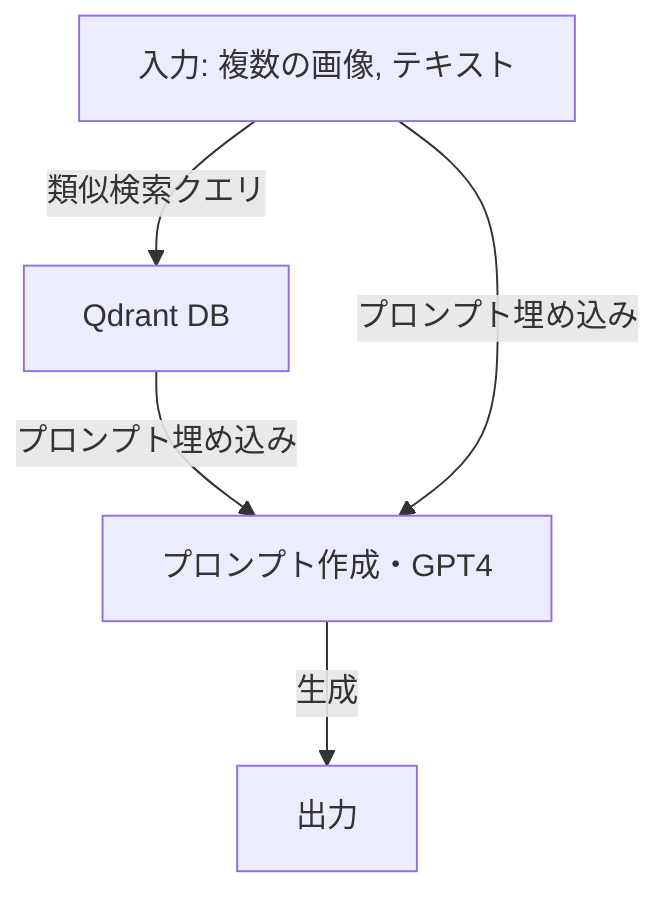

# MultiModal LLM Test
## イントロ
このリポジトリは[【ChatGPT】マルチモーダルRAGのリファレンス実装 ～多様な情報源から一貫性のある結果を引き出す～](https://qiita.com/ksonoda/items/28586434904c26ec465b)のサンプルコードを動かしたものです. 

およびその元ネタと思われる
[Advanced Multi-Modal Retrieval using GPT4V and Multi-Modal Index/Retriever](https://docs.llamaindex.ai/en/stable/examples/multi_modal/gpt4v_multi_modal_retrieval/)
を参照しています


関連すると思われる日本語サイトのリスト
- [LlamaIndexのマルチモーダルを試す](https://zenn.dev/kun432/scraps/308e9750c822bc)
- [LlamaIndex の マルチモーダルRAG のしくみ](https://note.com/npaka/n/n53e8aabed0f2)

マルチモーダルRAGに関するドキュメントのリスト
- [Image to Image Retrieval using CLIP embedding and image correlation reasoning using GPT4V](https://docs.llamaindex.ai/en/stable/examples/multi_modal/image_to_image_retrieval/#retrieve-images-from-multi-modal-index-given-the-image-query)

## 準備
### 環境変数
API keyをセットします
```
touch .env
```
でファイルを生成して
```
OPENAI_API_KEY = "Your OpenAI API key"
```
を書き加えてください. 

### Python
- Python=3.10
- pip install -r requirements.txt

(Anacodaによる構築がおすすめ。例えば、

conda create -n mllm python=3.10

conda activate mllm

pip install -r requirements.txt)

### Data
Vector DBのQdrantに埋め込むためのデータを収集します. 
実行パスを
```
cd resource_collect
```
に移して
```
bash collect_images.sh
```
を実行してください. プロンプトに埋め込むための画像を収集します. `see_images.py`で中身が確認できます. 
```
python collect_wikipedia_images.py
```
を実行してください. CLIPを使用してベクトルデータとしてDBに埋め込む画像・テキストデータを収集します. 

## テスト
モデルは"gpt-4-turbo"を使用してください. 

## 実装
複数の画像やテキストからllamaIndexのライブラリに実装済みの関数・メソッドのみでクエリを実行する例は見つからなっかた. 
RAGのフローをカスタムすれば実装できると思われる. 
### RAG flow
基本的なRAGの流れ

#### Qdrant DBの作成(db.py)
```python
from llama_index.core.indices import MultiModalVectorStoreIndex
from llama_index.vector_stores.qdrant import QdrantVectorStore
from llama_index.core import SimpleDirectoryReader, StorageContext
import qdrant_client
from llama_index.core import SimpleDirectoryReader

client = qdrant_client.QdrantClient(path="qdrant_mm_db")
text_store = QdrantVectorStore(
    client=client, collection_name="text_collection"
)
image_store = QdrantVectorStore(
    client=client, collection_name="image_collection"
)
storage_context = StorageContext.from_defaults(
    vector_store=text_store, image_store=image_store
)

# mixed_wikiのディレクトリにある画像データとテキストデータをベクトル変換し、Qdrantにロード
documents = SimpleDirectoryReader("./mixed_wiki/").load_data()

index = MultiModalVectorStoreIndex.from_documents(
    documents,
    storage_context=storage_context,
)
```

#### 類似検索クエリ(db_query_example.ipynb)
[QdrantDB](#qdrant-dbの作成)で作成した`index`を使う. 
```python
retriever = index.as_retriever(similarity_top_k=1, image_similarity_top_k=1)
```
-> 類似度上位1位のテキストと画像を取得するretrieverになる
```python
results = retriever.retrieve("類似検索したい文章")
```
-> 画像とテキストがDBから取得される
```python
text_ret_results = retriever.text_retrieve("類似検索したい文章")
```
-> テキストのみが取得できる
```python
retriever.text_to_image_retrieve("類似検索したい文章")
```
-> 画像が取得できる
```python
input_image = "./db_test_image/modely.png"
image_ret_results = retriever.image_to_image_retrieve(input_image)
```
-> 画像のみが取得できる

画像-> テキストは見当たらなかった. 

#### プロンプトへの埋め込み
プロンプトのテンプレートの用意
```python
qa_tmpl_str = (
    "Context information is below.\n"
    "---------------------\n"
    "{context_str}\n"
    "---------------------\n"
    "Given the context information and not prior knowledge, "
    "answer the query.\n"
    "Query: {query_str}\n"
    "Answer: "
)
qa_tmpl = PromptTemplate(qa_tmpl_str)
```
`context_str`: 取得したデータを埋め込む部分

`query_str`: 質問文

プロンプトへの取得してテキストデータの埋め込み
```python
prompt_str = qa_tmpl.format(context_str="埋め込むテキストデータ", query_str="質問")
```

画像をプロンプトに埋め込むための用意
```python
# put your local directore here
image_documents = [
    ImageDocument(image_path="画像へのpath"), 
    ImageDocument(image_path="画像へのpath")
]
```

用意した画像とプロンプトでGPTによる生成
```
openai_mm_llm = OpenAIMultiModal(
    model="gpt-4o", max_new_tokens=1500
)
response = openai_mm_llm.complete(
    prompt=prompt_str,
    image_documents=image_documents,
)
```

## トラブルシュート

### DB runtime error problem
```
RuntimeError: Storage folder qdrant_mm_db is already accessed by another instance of Qdrant client. If you require concurrent access, use Qdrant server instead.
```
-> DBは複数のインスタンスからアクセスできないようです.
ランタイムエラーが出た場合には一度全てのjupyter kernelを閉じてください. 


### Index embedding property None problem
```
ImageNode(id_='1d86b8f4-133e-4c0e-a479-54439ee0fbb8', embedding=None, ...
```
今の所, 詳しい原因はわからなかった
-> [see also](https://docs.llamaindex.ai/en/stable/api_reference/schema/#llama_index.core.schema.BaseNode)
